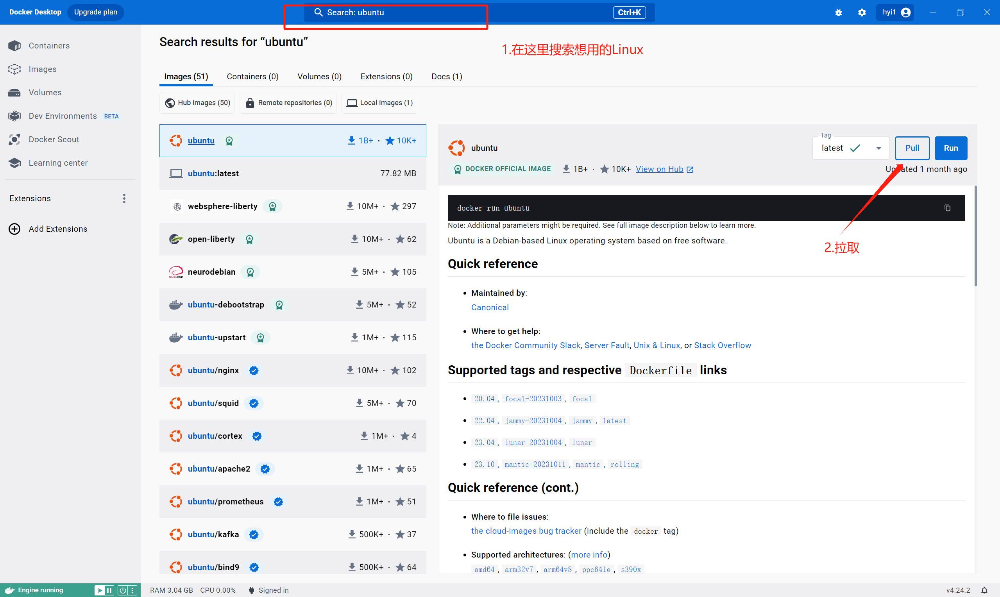
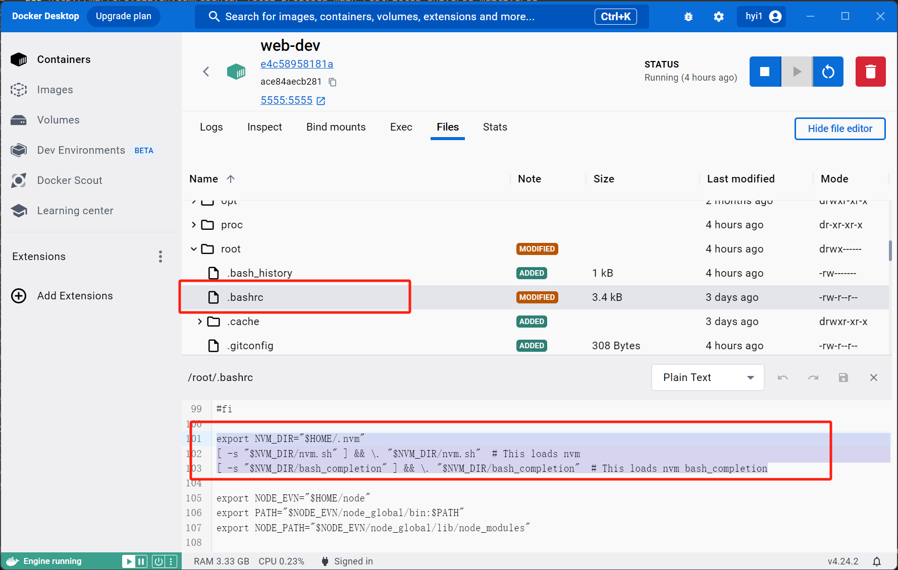
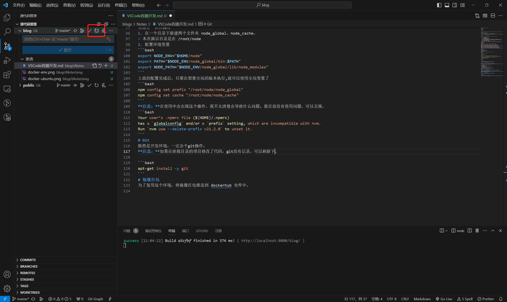

# 前言
在本教程中，我将演示如何使用VSCode基于Docker进行前端开发。我们将使用Ubuntu镜像作为基础镜像，配置一个简单的前端开发环境。
# 操作
## 安装Docker
首先，确保按照以下步骤安装Docker：

1. 在[Docker官网](https://www.docker.com/)下载DockerDesktop并按照说明进行安装。
2. 确保已开启虚拟化，并满足WSL版本、Windows版本的要求。具体要求请查看[适用于 Linux 的 Windows 子系统文档](https://learn.microsoft.com/en-us/windows/wsl/)

## 创建容器


```bash
docker run -itd -p 5555:5555 -v D:/project:/data --name 容器名称 镜像ID /bin/bash
```
- `docker run` 运行一个容器的命令。
- `-itd` 这是三个参数的组合：
    - `-i` 保持 STDIN 打开，即使没有连接上。
    - `-t` 分配一个伪终端。
    - `-d` 在后台运行容器并返回容器ID。
- `-p 5555:5555` 将容器内部的端口5555映射到宿主机的端口5555。这允许从外部访问容器内的应用程序。
- `-v D:/project:/data` 将主机的 D:/project 目录挂载到容器内的 /data 目录。这样可以在容器内外部共享文件。
- `--name 容器名称`为容器指定一个名字。
- `镜像ID` 是要运行的镜像的ID或者镜像名。
- `/bin/bash` 指定容器启动时执行的命令，这里是在容器内启动 Bash shell。
## 环境配置
我们使用的是纯净的Ubuntu镜像（大小只有72MB），具有最基本的能力。为了满足后续可能的需求，首先更新系统：
```bash
apt-get update
apt-get upgrade -y
```
为了提高速度，可以使用阿里源。打开 /etc/apt/sources.list 文件，添加以下内容：
```bash
deb http://mirrors.aliyun.com/ubuntu/ focal main restricted universe multiverse
deb http://mirrors.aliyun.com/ubuntu/ focal-security main restricted universe multiverse
deb http://mirrors.aliyun.com/ubuntu/ focal-updates main restricted universe multiverse
deb http://mirrors.aliyun.com/ubuntu/ focal-proposed main restricted universe multiverse
deb http://mirrors.aliyun.com/ubuntu/ focal-backports main restricted universe multiverse
deb-src http://mirrors.aliyun.com/ubuntu/ focal main restricted universe multiverse
deb-src http://mirrors.aliyun.com/ubuntu/ focal-security main restricted universe multiverse
deb-src http://mirrors.aliyun.com/ubuntu/ focal-updates main restricted universe multiverse
deb-src http://mirrors.aliyun.com/ubuntu/ focal-proposed main restricted universe multiverse
deb-src http://mirrors.aliyun.com/ubuntu/ focal-backports main restricted universe multiver
```
安装wget和sudo
```bash
apt-get install wget sudo -y
```
### 使用Node.js
这种其实不推荐，既然想直接使用了，
直接安装Node.js。
```bash
wget https://nodejs.org/dist/v14.18.0/node-v14.18.0-linux-x64.tar
```
解压文件
```bash
tar -xvf node-v14.18.0-linux-x64.tar
```
### 使用NVM
使用nvm管理Node.js
```bash
wget -qO- https://raw.githubusercontent.com/nvm-sh/nvm/v0.39.5/install.sh | bash
```
容器启动时自动加载nvm环境变量。你可以将nvm的初始化脚本添加到你的shell配置文件中，例如.bashrc或.zshrc。
```bash
export NVM_DIR="/home/packages/nvm-0.39.5"   # 这里路径一定要写对不然后面找不到nvm
[ -s "$NVM_DIR/nvm.sh" ] && \. "$NVM_DIR/nvm.sh" # This loads nvm
```
添加完成后执行以下代码，重新加载配置
```bash
source ~/.bashrc
```
或者
```bash
. ~/.bashrc
```
> 我看的教程需要进行这个操作，但是实际操作中已经存在这个段代码。
> 


到这里，基本环境已经配置完成。根据你的开发需求下载相应的依赖即可。
### 全局依赖
nvm的node是隔离的，不同版本间全局依赖可能会重复下载，要解决这个问题，可以让 nvm 下node 所以版本使用一个全局依赖和全局缓存空间。

先进行一次性操作
1. 在一个目录下新建两个文件夹 node_global、node_cache。
> 本次演示目录是在 /root/node
2. 配置环境变量
```bash
export NODE_ENV="$HOME/node"
export PATH="$NODE_ENV/node_global/bin:$PATH"
export NODE_PATH="$NODE_ENV/node_global/lib/node_modules"
```
上面的配置完成后，只要在想要全局的版本执行,就可以使用全局变量了
```bash
npm config set prefix "/root/node/node_global"
npm config set cache "/root/node/node_cache"
```
> 在使用中会出现这个提示，我不太清楚会导致什么问题。我目前没有使用问题，可以无视。
> ```bash
> Your user’s .npmrc file (${HOME}/.npmrc)
> has a `globalconfig` and/or a `prefix` setting, which are incompatible with nvm.
> Run `nvm use --delete-prefix v21.2.0` to unset it.
> ```
# 额外的
## Git
既然是开发环境，一定会有git的操作。
```bash
apt-get install -y git
```
> 如果在挂载目录的项目修改了代码，git没有记录，可以刷新下。
> 